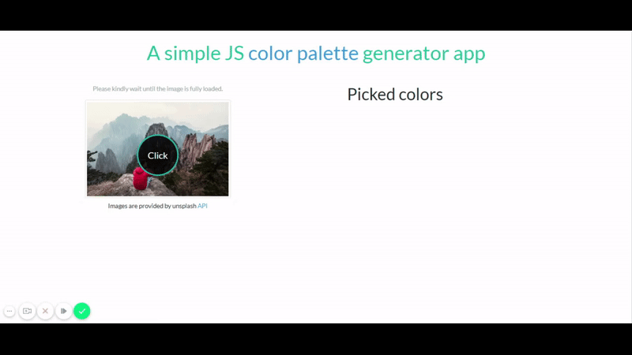

# Simple Color Palette Generator using Vanilla JavaScript

Make sure to open the project on local server for it to work properly.

The `.htaccess` file only purpose is to allow fetching the resources from [Unsplash](https://source.unsplash.com/) API.

