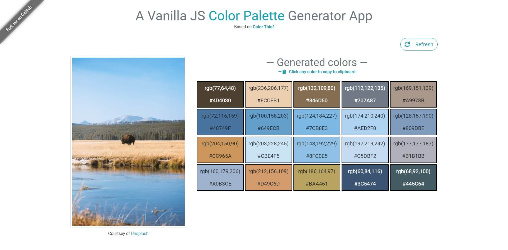

# Simple Color Palette Generator using Vanilla JavaScript

> **The formulation is based on the [HSP Color Model](http://alienryderflex.com/hsp.html).**

## Index

1. [Getting Started](#getting-started)
2. [Preview](#preview)

---

### Getting Started

> This app is using [Color Theif](//lokeshdhakar.com/projects/color-thief/).

Start your project by running `npm install` or `yarn install` followed by `npm start` or `yarn start`.

---

### Preview

.
